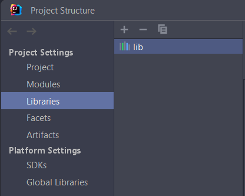
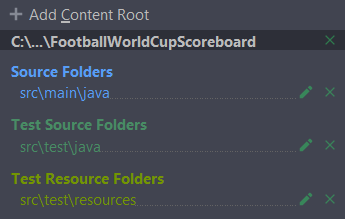
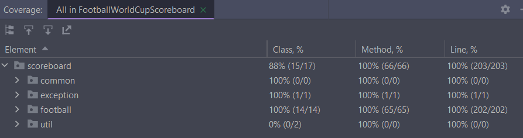
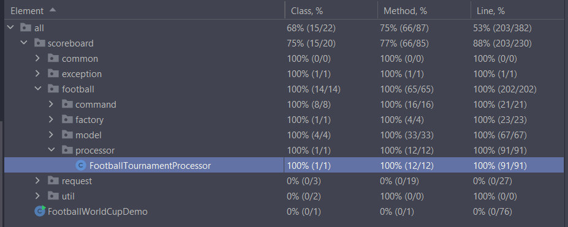

## Live Football World Cup Score Board
### Getting Started
1. To start working with this library you need to add lib directory (src/lib) to the project structure. For example, in IntelliJ IDEA 



2. Create a resource folder in test folder (src/test) 


3. Check your project structure modules for 



## Overview
I decided to write in pure Java without Spring and Maven, etc., but it's easy to add them in the future

This library utilises common objects to create abstract structure for the most match based sport activities in mind.
As per task requirements it implements only Live Football World Cup Score Board, but I tried to make it as much open 
for the new match types as possible

The main idea is that we using abstract factory ```FootballFactory``` to create and validate business logic for football

Then we are creating the ```FootballTournament``` that will contain all the info about matches and their score, and comparator to sort matches

After that we are instantiating the ```FootballTournamentProcessor``` which will deal with ```FootballTournament``` 
implementing the logic for starting, ending matches, updating their score, printing or exporting the scoreboard

For better scalability I've added command classes and their executor ```FootballTournamentCommandExecutor```
With commands it would be easy to implement different functionality in the future, be it command queues, command history, event listening, etc.

I've decided to use Team name as unique id for Teams and a pair of home team and away team names as unique id for matches

I decided that you can't change the teams name when it's already created because I guess there must be more complex logic to change the name of the team,
like, for example, we need to check if it's participating in some tournaments and/or matches, etc.
Also, ``Barcelona`` and ``barcelona`` and ``barcelona `` would be treated as different teams, so I added
```java
private String formatString(String name){
    return StringUtils.lowerCase(StringUtils.trim(name));    
}
```
to the equals and hash code method of team to incorporate some way to deal with bad data, as name is used as ID, but there were no no requirements for special characters, symbols, numbers and case were not presented, but it's easy to add them, if needed.

Also adding ID's to the objects in future would be good

And I created my own exceptions ```MatchCommonException``` for marking them as business logic errors and to easier work with them in the future, like with custom exception interceptors, etc.

But in constructors I maintained the general exceptions as I treat them as lower level and not as a business logic errors

For example, I'm validating the team name only through a factory and letting it be as it is through constructor, but for football score it always should be greater then zero, so there are validations both in factory with custom exception and in the constructor with ```IllegalArgumentException```. Also, same for score setters.

Also, I'm not treating the same score as before, when trying to update the score for match as an error, just as an info in logger

For example, match Mexico 0 - Canada 5, and update comes with same scores Mexico 0 - Canada 5, so it's better to just inform user, but not to throw some exceptions, but that's depends on business logic again

I've added ``FootballWorldCupDemo`` and request directory ``(src/main/java/scoreboard/request)`` only to imitate some form of demo data, so there are no test coverage for them as it it is meant only for presenting the demo of the library functionality

Without ``FootballWorldCupDemo`` and request directory (src/main/java/scoreboard/request) the test coverage have this value:



With them the coverage is:

