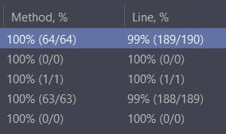

# FootballWorldCupScoreboard
1. To start working with this library you need to add lib directory (src/lib) to the project structure. For example, in IntelliJ IDEA 

2. Create a resource folder in test folder (src/test) 

Without FootballWorldCupDemo and request directory the test coverage have this value:

